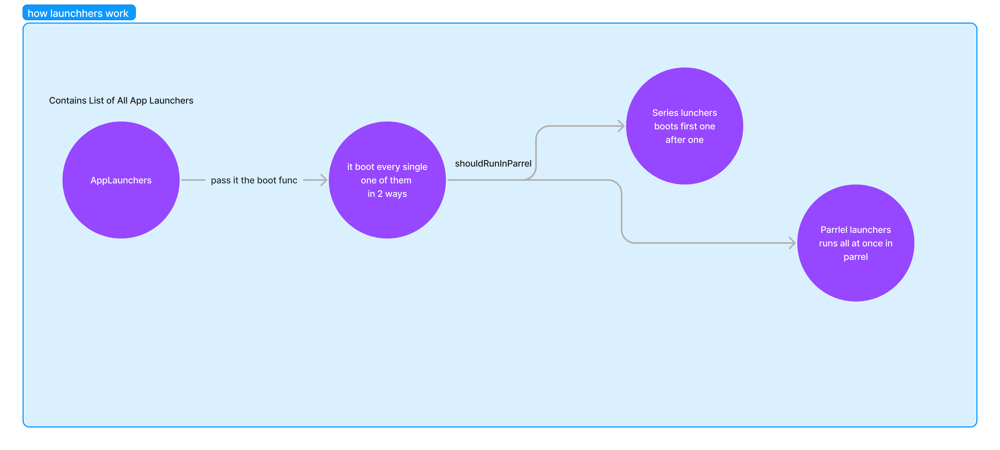

# Launchers

Introduction
Launchers are the way queen organize the process of register dependencies and bootstrap for Queen . Your own application, and other developers packages ,


 
 

## Boot

In general, we mean registering things, including registering services, controllers, other packages dependencies and to bootstrap them if needed `boot` will be called before the application run

```dart

class ThemeLauncher extends Launcher {

  @override
  FutureOr<void> boot() async => AwesomeController().init();

}


```

## shouldRunInParallel

if `false` the Launcher boot will called after the previous one is done
if `true` will boot in parallel with other Launchers (apps boot faster)

```dart

class ThemeLauncher extends Launcher {

  @override
  bool get shouldRunInParallel => true;

}


```
